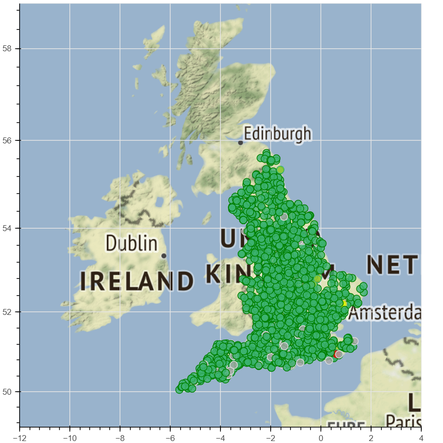
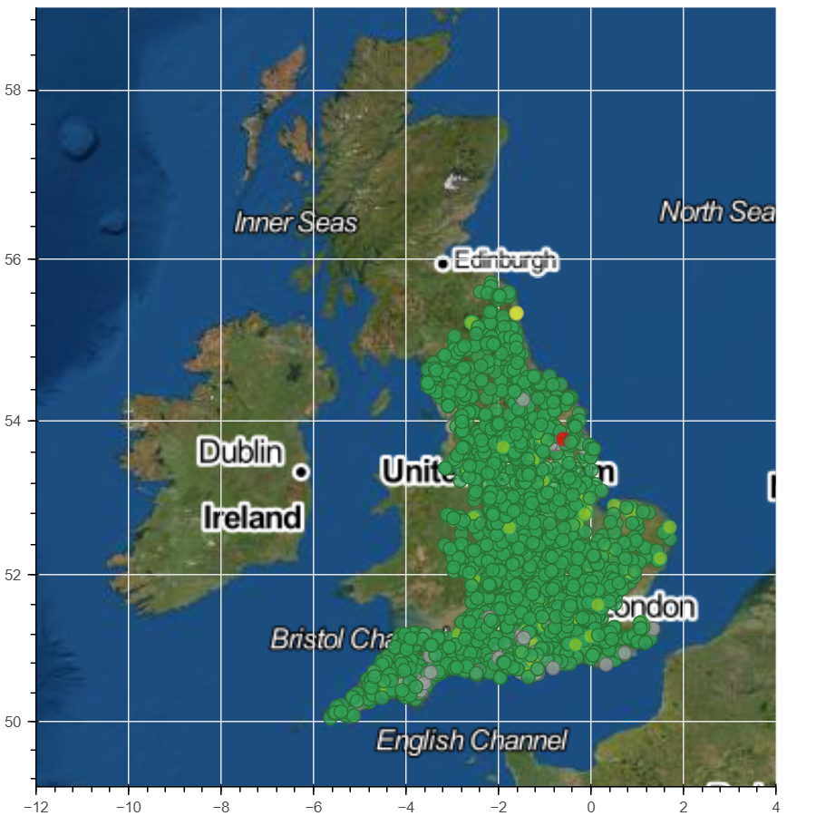
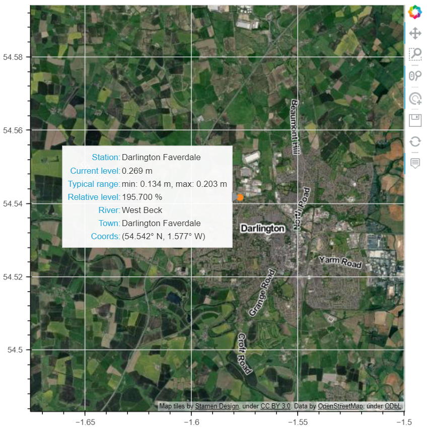
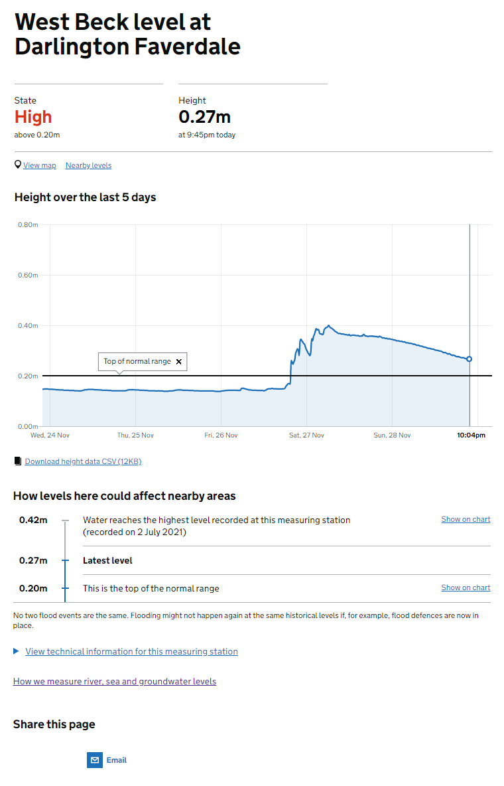
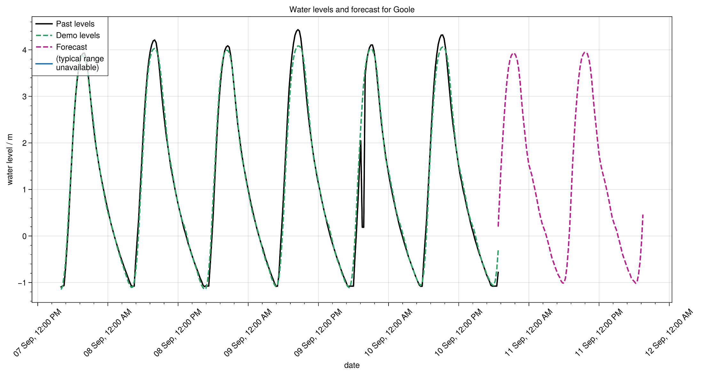
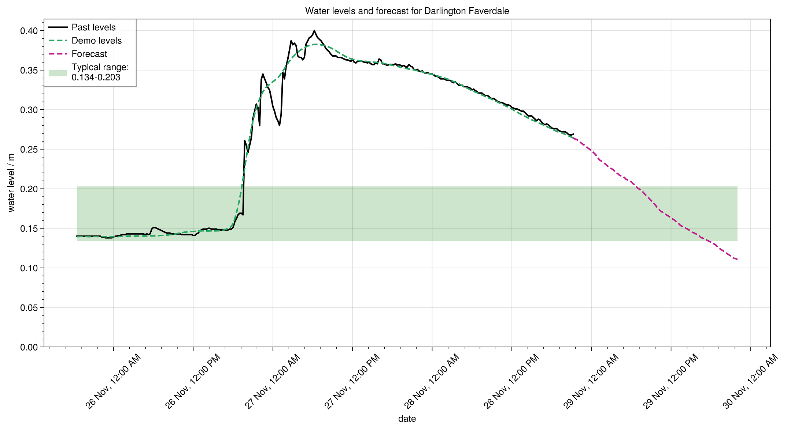

# Flood Warning System

An API and demo frontend for monitoring flood likelihood in England, UK. Built to extend the Part IA Lent Term computing activity at CUED. Run the files in the `tasks` directory to see the standard functionality,
or by using

```shell
$ ./runtasks.sh
```

The tasks are documented [here](https://cued-partia-flood-warning.readthedocs.io/).


## Map Plotting

View the map by running `python applications/MapViewer.py`.

Map of stations across England:



Hover over a dot to view basic info:



Click on a dot to go to the official [gov.uk](https://check-for-flooding.service.gov.uk/) site for the station:



## Forecasting

View some forecasts by running `python applications/LevelPredictions.py`. Forecasting can be done at each station by training and predicting from an LSTM (long short-term memory) RNN (recurrent neural network). Training and evaluation is done with `tensorflow.keras` and `sklearn`.

Example 1: forecast of a tidal stations:



Example 2: forecast of a river level shortly after a storm event (predicted the rise, but likely overestimates the future fall)



## Installing

After (optionally) navigating to any directory using `$ cd C:\path\to\download\location`, use

```
git clone https://github.com/lorcan2440/Flood-Warning-System.git
cd Flood-Warning-System
pip install .
```

The `floodsystem` module will then be available for use. Alternatively, if `git` is unavailable, the package can be downloaded manually by using [this](https://download-directory.github.io/) tool. Unzip the folder, go inside and use `pip install .` when in the same folder as `setup.py` and the various other files.

## Usage

Various uses of the API are given in the `tasks` folder. To get started,

```python
from floodsystem.stationdata import build_station_list, update_water_levels

stations = build_station_list()
update_water_levels(stations)
```

Then the functions can be used, e.g.

```python
from floodsystem.flood import stations_level_over_threshold
print(stations_level_over_threshold(stations, 1.0))
```
