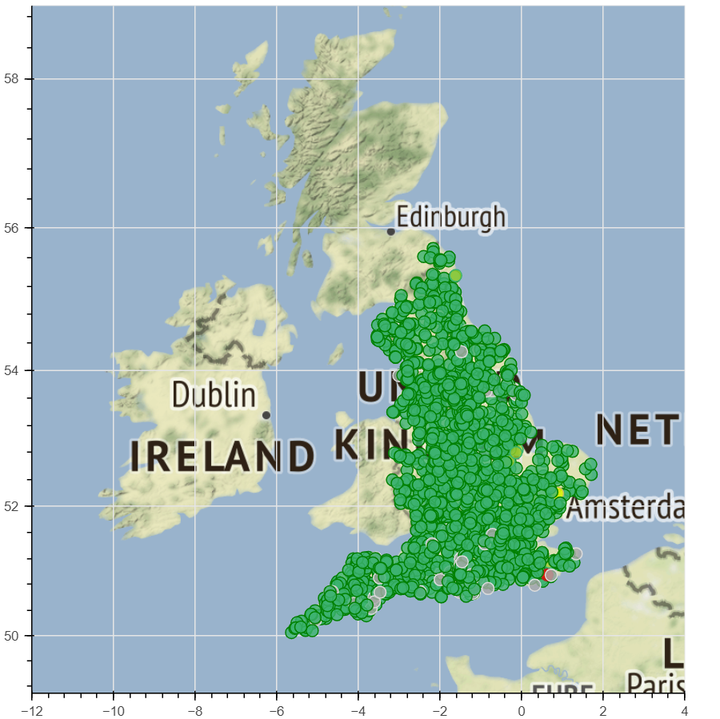
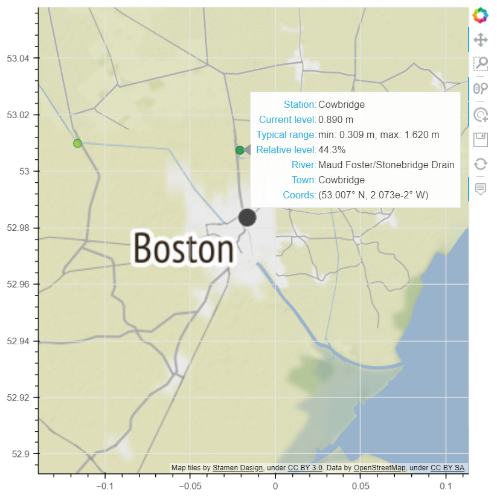
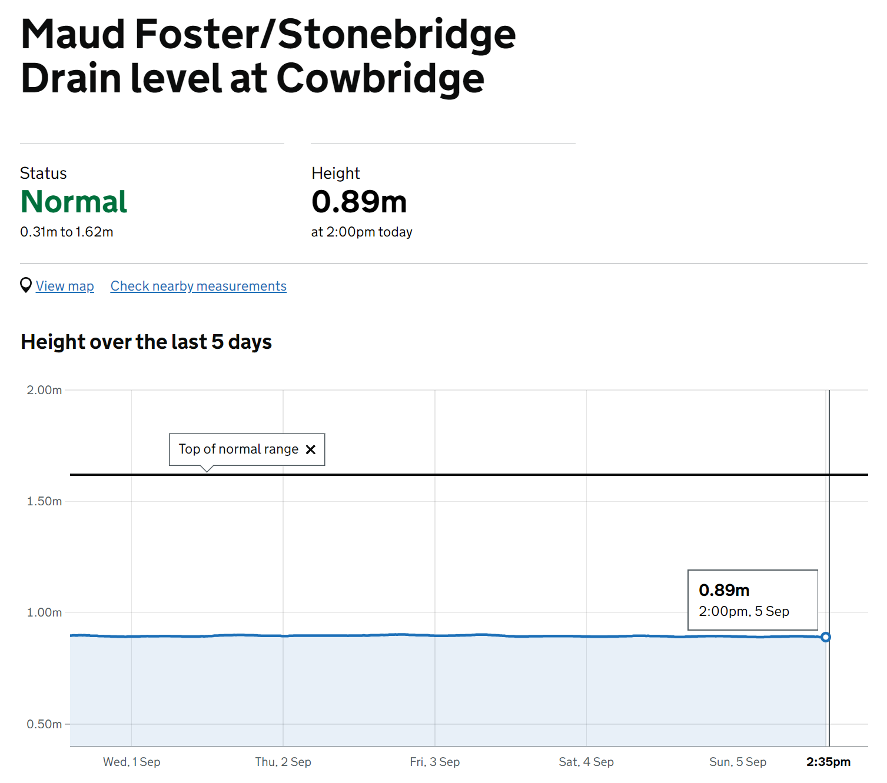

# Flood Warning System

An API and demo frontend for monitoring flood likelihood in England, UK. Built to extend the Part IA Lent Term computing activity at CUED. Run the files in the `tasks` directory to see the standard functionality,
or by using

``` shell
$ ./runtasks.sh
```

The tasks are documented at https://cued-partia-flood-warning.readthedocs.io/.


## Map Plotting

View the map by running `python applications/MapViewer.py`.

Map of stations across England:



Hover over a dot to view basic info:



Click on a dot to go to the official [gov.uk](https://check-for-flooding.service.gov.uk/) site for the station:



## Forecasting

View some forecasts by running `python applications/LevelPredictions.py`. Forecasting can be done at each station by training and predicting from an LSTM (long short-term memory) RNN (recurrent neural network). Training and evaluation is done with `tensorflow` and `scikit-learn`.


## Installing

Currently this is not available on PyPI. Instead, you can go [here](https://download-directory.github.io/) and download the `floodsystem` module at https://github.com/lorcan2440/Flood-Warning-System/tree/main/floodsystem. Name the zipped folder `floodsystem.zip`. Extract the floodsystem module to the directory of your program.

## Usage

Various uses of the API are given in the `tasks` folder. To get started,

``` python
from floodsystem.stationdata import build_station_list, update_water_levels

stations = build_station_list()
update_water_levels(stations)
```

Pass in `stations` to the API functions to see the results, e.g.

``` python
from floodsystem.flood import stations_level_over_threshold
print(stations_level_over_threshold(stations))
```
